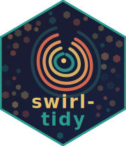

# swirl-tidy <a href="https://github.com/sysilviakim/swirl-tidy"></a>

<!-- badges: start -->
<!-- badges: end -->

swirl-tidy is a series of interactive [swirl](https://swirlstats.com/)
lessons that teach the [tidyverse](https://www.tidyverse.org/) in R.
It covers importing, transforming, and visualizing data using tidyverse
packages including dplyr, ggplot2, tidyr, readr, stringr, forcats,
lubridate, and purrr.

## Installation

```r
install.packages("swirl")
library(swirl)
install_course_github("sysilviakim", "swirl-tidy")
swirl()
```

<br clear="all" />

## Lessons

| # | Lesson | Topic |
|---|--------|-------|
| 01 | Overview | Introduction to the tidyverse |
| 02 | Introduction to tibbles | Tibbles vs. data frames |
| 03 | Introduction to pipes | The pipe operator |
| 04 | Import with readr | Reading CSVs and text files |
| 05 | Import with haven | Reading SPSS, Stata, SAS files |
| 06 | Import with readxl | Reading Excel files |
| 07 | Transform with dplyr I | filter, select, arrange |
| 08 | Transform with dplyr II | mutate, if_else, case_when |
| 09 | Transform with dplyr III | group_by, summarise |
| 10 | Transform with dplyr IV | Joins and set operations |
| 11 | Transform with dplyr V | across, rowwise, count, slice |
| 12 | Reshape with tidyr | pivot_longer, pivot_wider |
| 13 | Strings with stringr | String manipulation |
| 14 | Factors with forcats | Working with factors |
| 15 | Dates with lubridate | Date and time parsing |
| 16 | Iterate with purrr | Functional programming with map |
| 17 | Visualize with ggplot2 I | Basics of ggplot2 |
| 18 | Visualize with ggplot2 II | Intermediate ggplot2 |
| 19 | Visualize with ggplot2 III | Advanced ggplot2 |
| 20 | Epilogue | Wrap-up and further resources |

## Getting help

If you encounter issues or have suggestions, please
[file an issue](https://github.com/sysilviakim/swirl-tidy/issues).
Pull requests are welcome.
